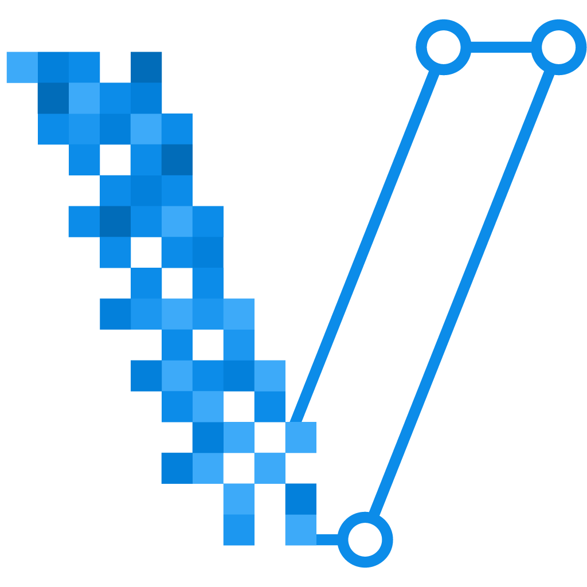
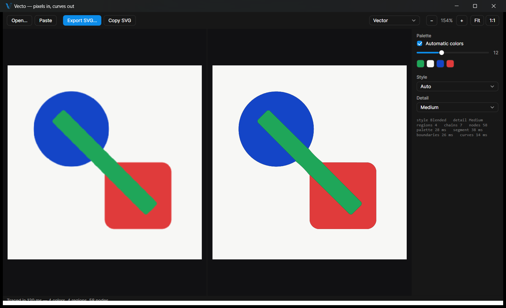

<p align="center">
  
</p>

<h1 align="center">Vecto</h1>

<p align="center">
  <b>Free, open-source image-to-vector converter.</b><br/>
  Trace PNG and JPG images — logos, icons, illustrations, pixel art, scans — into clean, editable <b>SVG</b><br/>
  with mathematically exact circles, true straight lines, and zero gaps between shapes.
</p>

<p align="center">
  
  
  
  
</p>



**Vecto** is a bitmap-to-vector tracing app (auto-tracer / image vectorizer) in the spirit of
Vector Magic and Adobe Illustrator's Image Trace — but free, open source, and built around one
structural idea: the traced image is a **planar partition**. Every boundary between two shapes
is fitted *once* and shared by both sides, so the output physically cannot contain the hairline
gaps and overlaps that plague most PNG-to-SVG converters.

## Why Vecto instead of other vectorizers?

- **No gaps, no overlaps — by construction.** Shared-boundary planar tracing (the same
  property Vector Magic's output has, and stacked-layer tracers like potrace don't).
- **Geometric intelligence.** Straight edges become true straight lines, circles and round
  caps become mathematically exact arcs (least-squares circle fits) — not wobbly
  approximations. Icons and logos come out looking *designed*, not traced.
- **Sub-pixel precision.** Anti-aliasing encodes where the real edge is; Vecto reads it and
  places boundaries at sub-pixel positions instead of snapping to the pixel grid.
- **Live side-by-side compare** with synced zoom/pan, segmentation view, palette swatches,
  and instant re-trace on every setting change. Copy the SVG straight to your clipboard.
- **Fast.** A 250 px logo traces in ~60 ms; a 4K photo posterizes in ~4.5 s.
- **Deterministic and tested.** Same input → byte-identical SVG; 14 geometric-invariant
  tests (exact area preservation, corner exactness, circle accuracy, culture safety).
- **Headless CLI + benchmark harness** for batch tracing and objective quality measurement.

## Install

### Option 1 — Download (recommended, no setup)

Grab the latest from the **[Releases page](https://github.com/DanielMevit/Vecto/releases)**:

- **`Vecto-x.y.z.exe`** — the desktop app as one self-contained file. Download, run, done —
  no .NET, no installer.
- **`Vecto-x.y.z-win-x64.zip`** — the app **plus the `vecto` command-line tool** (unzip
  anywhere; add the folder to `PATH` to use `vecto` from any terminal).

**CLI for Linux and macOS** (`vecto-x.y.z-linux-x64` / `-osx-x64` / `-osx-arm64`) is on the same page — full tracing, batch and benchmarking from any terminal (`chmod +x` after download).

SHA-256 checksums are listed in each release. Windows SmartScreen may warn on first run
(new, unsigned executable) — choose *More info → Run anyway*.

### Option 2 — Build from source

Requires Windows 10/11 and the free
[.NET 8 SDK](https://dotnet.microsoft.com/download/dotnet/8.0):

```bash
git clone https://github.com/DanielMevit/Vecto.git
cd Vecto
dotnet build -c Release
```

After the build:

- **Desktop app:** `Vecto.App\bin\Release\net8.0-windows\Vecto.exe` — run it directly or
  pin it to the taskbar.
- **CLI:** `Vecto.Cli\bin\Release\net8.0\vecto.exe` — add that folder to your `PATH` to
  call `vecto` from anywhere.

## Using Vecto

**App:** drop / paste (Ctrl+V) / open any PNG, JPG, BMP or GIF → automatic trace →
export or copy SVG. Transparency is preserved. Tip: feed the highest-resolution image you
have — trace quality scales with input size.

**CLI:**

```bash
vecto trace logo.png -o logo.svg --stats       # vectorize an image
vecto trace photo.jpg --style photo --colors 24
vecto bench original.svg --scale 2             # round-trip quality benchmark vs ground truth
vecto samples out/                             # generate test images
```

## How it works

Palette inference (weighted k-means++ in Oklab) → segmentation with small-region absorption
→ **planar boundary graph** (every chain between junctions traced once, shared by both
regions) → corner detection with sub-pixel validation → clamped smoothing + sub-pixel edge
refinement → simplest-model-first fitting (line → circular arc → least-squares Bezier) →
compact SVG. The full stage-by-stage map with parameters and code anchors lives in
[`docs/ai/ALGORITHM_INDEX.md`](docs/ai/ALGORITHM_INDEX.md).

Every algorithm is from the open literature (Schneider curve fitting, k-means++, Kåsa
circle fit, Oklab, Douglas–Peucker) — no license-encumbered code anywhere in the engine.

## Comparison

| | Vecto | potrace / Inkscape | Illustrator Image Trace | Vector Magic |
|---|---|---|---|---|
| Price | **Free, MIT** | Free | Subscription | Paid |
| Full color | ✅ | ⚠️ per-layer stacking | ✅ | ✅ |
| Gap/overlap-free output | ✅ planar | ❌ | ⚠️ | ✅ |
| Exact lines & circles | ✅ | lines only | ❌ | ❌ |
| Open source | ✅ | ✅ | ❌ | ❌ |
| Headless CLI + bench | ✅ | CLI only | ❌ | ❌ |

## Roadmap

Palette editor & tracing wizard, background removal, batch mode, PDF/EPS/DXF export,
segmentation editing tools, centerline (stroke) tracing. See [ROADMAP.md](ROADMAP.md).

## Contributing & docs

The repo is agent-friendly and human-friendly: start at [`AGENTS.md`](AGENTS.md) →
[`docs/ai/START_HERE.md`](docs/ai/START_HERE.md). Build must stay at 0 warnings; every
engine change should pass `vecto bench` before/after. PRs welcome.

## License

[MIT](LICENSE) © Daniel Mevit. Engine (`Vecto.Core`) has zero dependencies; the CLI uses
SixLabors.ImageSharp 3.1.x for image decoding.

---

*Keywords: image to vector converter, PNG to SVG, JPG to SVG, vectorize logo, image
tracing software, auto trace, bitmap to vector graphics, free Vector Magic alternative,
Illustrator Image Trace alternative, potrace alternative with color, SVG converter
Windows, vectorizer C# .NET.*
